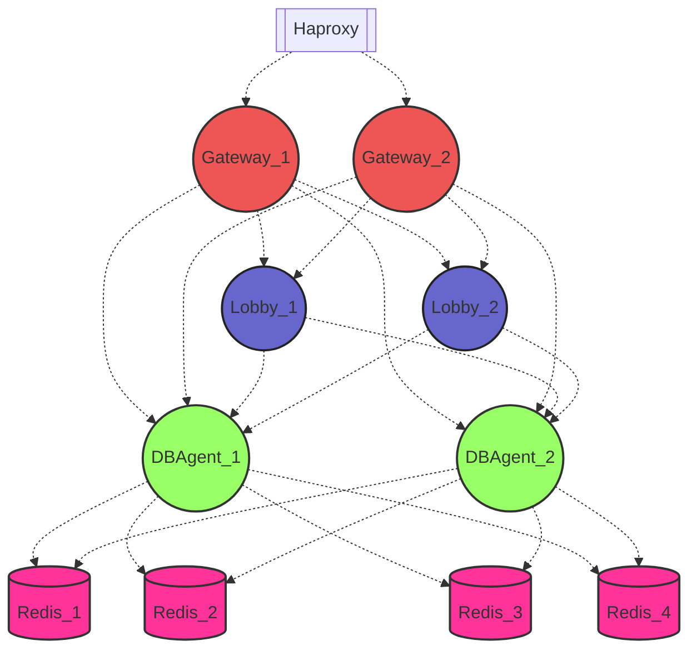

# 总体拓扑图

```mermaid
flowchart TB
    ha[[Haproxy]]
    g1((Gateway_1))
    g2((Gateway_2))
    l1((Lobby_1))
    l2((Lobby_2))
    d1((DBAgent_1))
    d2((DBAgent_2))
    r1[(Redis_1)]
    r2[(Redis_2)]
    r3[(Redis_3)]
    r4[(Redis_4)]

    ha .-> g1 & g2
    g1 .-> l1 & l2 & d1 & d2
    g2 .-> l1 & l2 & d1 & d2

    l1 .-> d1 & d2
    l2 .-> d1 & d2

    d1 .-> r1 & r2 & r3 & r4
    d2 .-> r1 & r2 & r3 & r4

    classDef dba fill:#99ff66,stroke:#333,stroke-width:2px;
    classDef redis fill:#ff3399,stroke:#333,stroke-width:2px;
    classDef gate fill:#ee5555,stroke:#333,stroke-width:2px;
    classDef lobby fill:#6666cc,stroke:#222,stroke-width:2px;

    class d1,d2 dba
    class r1,r2,r3,r4 redis
    class g1,g2 gate
    class l1,l2 lobby

```
